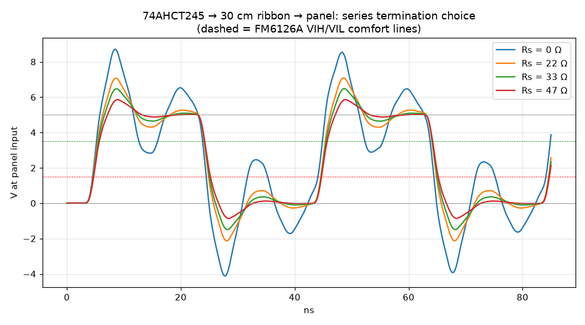
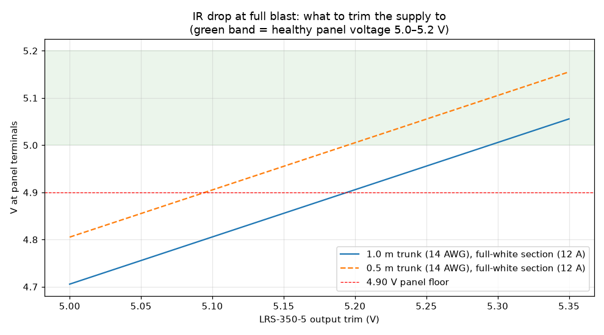
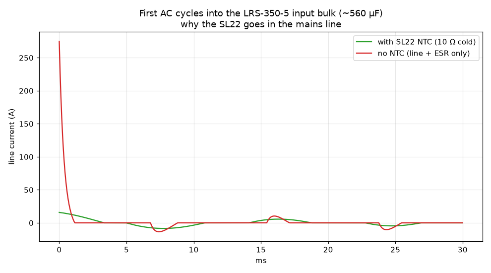

# Album Art Matrix

A design for an LED wall that shows the cover of whatever song is playing, rendered as a slowly
spinning disc. Nine square LED panels tiled three by three, 480 mm on a side, driven by a Raspberry
Pi 5.

**No hardware has been driven yet.** Not nine panels, not one. This repository is the design, the
circuit simulation, and the software that will run on it, all written and tested before the parts
were ordered. The section below is exact about what exists.

## Status

| Piece | State |
| --- | --- |
| Circuit simulation (`pcb/sims/`) | Done and reproducible. Eight ngspice decks, verified to regenerate their committed outputs bit for bit. |
| Backplane circuit (`pcb/circuit.py`) | Done as a netlist and BOM. 76 components, 105 nets, 345 pin connections. |
| PCB layout | **Not started.** No KiCad project, no board file, no gerbers, no design rule check. |
| Art pipeline (`brain/art/`) | Built, runs on a laptop, has an offline test. |
| Now playing, Apple Music (`brain/nowplaying/applemusic.py`) | Built, 216 lines. |
| Now playing, Spotify (`brain/nowplaying/spotify.py`) | Built, 223 lines, dormant behind a config flag. |
| Now playing, Last.fm / AcoustID / local player | **Stubs.** Each is a class whose `get_current()` returns `None`. |
| Renderer (`renderer/art_display.c`) | 92 lines of C, written. **Never compiled**, because it links a library that only builds on a Pi. |
| Pi provisioning (`pi/`) | Scripts written. Never executed. `pi/PI-SETUP.md` step 3 begins with "Pi arrives". |
| Parts | **Not purchased.** `PARTS.md` is a shopping list with live links and prices checked 2026-08-19, covering the Pi, the panels, the power supplies, and a soldering iron. |
| White balance gains | Placeholders. `config.example.toml` labels the current values "a GUESS" pending measurement. |

One commit. The whole thing was designed in a single sitting, which is why the honest framing
matters: none of it has met a panel.

## What problem this solves

Music has a cover, and almost nobody looks at it any more. It lives in a thumbnail the size of a
postage stamp, at the corner of a phone that is in a pocket. The cover is the one piece of visual art
that shipped with the record, and the streaming era has quietly retired it.

An LED matrix wall puts it back on the wall at the size it deserves, and makes it live: it changes
when the song changes, without anyone touching anything.

The obvious approach, a cheap TV showing a full screen image, fails for a specific reason. A TV in a
room reads as a switched-on screen. It has a bezel, a backlight glow, an off state that is a grey
rectangle. An LED matrix behind a diffuser reads as an object that emits light, closer to a lamp or a
sign than a display, and its off state is genuinely black. That difference is the entire point of
building the hard version.

## What HUB75 is

HUB75 is the de facto wiring standard for chainable RGB LED matrix panels. A 16 pin ribbon carries
six colour data lines (two sets of red, green, blue, because the panel drives two rows at once), five
row address lines named A through E, a clock, a latch, and an output enable.

The important thing about HUB75 is what it does **not** have: memory, or brightness control, or any
intelligence at all. The panel is a shift register attached to LEDs. It displays exactly one row pair
at a time, and it stays lit only for as long as you hold output enable low. To make a picture, the
host has to scan every row of the panel, over and over, fast enough that persistence of vision fuses
the rows into an image, and it has to modulate the on time of each row to produce anything other than
full brightness. If the host stops, the image does not freeze. It goes dark.

That is why this project needs a real time thread pinned to a dedicated CPU core, and why the signal
integrity of a 25 MHz clock down a ribbon cable is a design problem rather than a detail.

## How it works

```
  Mac                          Pi 5
  ---                          ----
  Music.app ---+
               +--> mac_reporter.py --HTTP--> brain/main.py
  MusicKit  ---+   (port 8787)                     |
  helper                                           | poll, detect track change
                                                   v
                                          art/fetch.py
                                          cover URL to cached image
                                                   |
                                                   v
                                          art/pipeline.py
                                          Lanczos downscale, unsharp, sRGB to
                                          linear, white balance, re-encode
                                                   |
                                                   v
                                          sinks/pi_renderer.py
                                          one RGB888 frame per open/write/close
                                                   |
                                                   v
                                          /tmp/album-frame.fifo  (named pipe)
                                                   |
                                                   v
                                          renderer/art_display  (C daemon)
                                          reader thread, plus a refresh thread
                                          pinned to isolated CPU 3
                                                   |
                                                   v
                                          HUB75 ribbon --> LED panels
```

The seam worth noticing is the named pipe. The brain and the renderer are separate processes that
share nothing but a byte stream of raw pixels, so either can be restarted, replaced, or run under a
debugger without the other caring. `art_display` re-opens the pipe on end of file and keeps showing
the last frame it received, so a crashed or upgraded brain leaves the wall lit rather than black.

On a laptop, `sinks/mac_preview.py` swaps in for the pipe and writes a scaled up PNG with a pixel
grid instead. That is how the whole image path was developed with no panel in the room.

## The simulations

This is the part of the project that is fully substantiated, and it is the part worth reading.

`pcb/sims/run_sims.py` writes ngspice decks, shells out to `ngspice -b`, and plots the results. Five
deck templates produce eight numeric output files and three figures, all committed. I re-ran all
eight decks from the committed `.cir` files and compared against the committed `.txt` outputs: every
one matches bit for bit, so the numbers below are reproducible rather than remembered.

Read them as circuit models, not as measurements. Nothing here has been checked against a real board,
because there is no real board.

### Why HUB75 lines need series termination



A logic driver puts out a fast edge. A 30 cm ribbon cable is not a wire, it is a transmission line
with inductance and capacitance distributed along it, and the panel at the far end is a high
impedance input that reflects almost all of the energy that arrives back toward the driver. The
reflection returns, bounces off the driver, and comes back again. What you see at the panel is
ringing: the voltage overshoots well past the supply rail, undershoots below ground, and settles only
after several round trips.

Series termination is the cheap fix. Put a resistor in line at the driver so that the driver's output
impedance plus the resistor roughly matches the cable's characteristic impedance. The reflection that
comes back is then absorbed instead of re-launched.

The sweep drives a 25 MHz pulse through an 18 ohm source resistance and a six section lumped LC
ladder standing in for the ribbon (25 nH and 2.5 pF per section), into an 18 pF panel input.

| Series resistor | Peak at panel input | Worst undershoot |
| --- | --- | --- |
| 0.1 ohm (effectively none) | 8.71 V | -4.11 V |
| 22 ohm | 7.09 V | -2.13 V |
| **33 ohm** | **6.48 V** | **-1.49 V** |
| 47 ohm | 5.86 V | -0.86 V |

Undamped, a 5 V signal swings to 8.7 V and to -4.1 V. Those excursions are what the panel driver
chip's input protection diodes have to eat, on every clock edge, forever.

47 ohm damps hardest, but it also slows the edge, and at 25 MHz the edge is a large fraction of the
bit period. 33 ohm is the value in `pcb/DESIGN.md`, chosen from this sweep as the point where
overshoot is tamed without blunting the edge. One caveat this figure carries in its own legend: the
plot says "Rs = 0" for the first trace because the script formats the label with `int(rs)`, while the
deck actually uses 0.1 ohm.

### What IR drop costs across the power distribution



An LED panel at full white is a serious load. One 64 by 64 P2.5 panel pulls roughly 4 A, so a section
of three panels pulls about 12 A. Copper has resistance, and 12 A through even a short run of 14 AWG
wire, a fuse, fuse clips, and a panel harness adds up to a voltage that is missing by the time it
reaches the panel. That is IR drop: current times resistance, the voltage the wiring keeps for
itself.

It matters because these panels are not tolerant. Below roughly 4.9 V the driver chips start
misbehaving, and the symptom is not a clean failure. It is dim patches, colour shifts on bright
frames, and flickering that only appears on white heavy album covers.

The deck is a DC sweep of the supply's output trim, with three constant current loads of 4 A each,
through modelled trunk wire, 7 milliohm of fuse and clips, and 0.4 m of 18 AWG harness per panel.

| Trunk length | Panel voltage at 5.00 V trim | Trim needed for 5.00 V at the panel |
| --- | --- | --- |
| 1.0 m of 14 AWG | 4.71 V | about 5.30 V |
| 0.5 m of 14 AWG | 4.81 V | about 5.20 V |

So a supply set to a perfect 5.00 V delivers 4.71 V to the panel, below the floor, and the wall
misbehaves on bright frames for reasons that look like a software bug. The answer is not thicker wire
alone, it is to trim the supply up so the panel lands in range, and the sweep says exactly how far.
Halving the trunk length is worth 0.10 V, which is why the design splits the wall into three
independent 12 A sections instead of running one 36 A trunk.

### Why inrush limiting matters



A switching power supply has a large capacitor across its input. At the instant you plug it in, that
capacitor is empty, and an empty capacitor looks like a short circuit. The only thing limiting the
current is the resistance of the mains wiring and the capacitor's own equivalent series resistance,
which together are a fraction of an ohm.

The deck models the first few AC cycles into roughly 560 uF of input bulk, at the worst case moment
of connection (the peak of the mains sine wave).

| Configuration | Peak line current |
| --- | --- |
| No limiter | 275 A |
| SL22 NTC thermistor, 10 ohm cold | 15.8 A |

275 A is a number that trips breakers, welds switch contacts, and shortens the life of everything it
passes through. The fix is a negative temperature coefficient thermistor in the mains line: cold, it
is 10 ohm and limits the surge to 16 A, and then it self heats within a second or two down to a
fraction of an ohm so it costs almost nothing during normal running. This is why an SL22 10005 is on
the Mouser line of `PARTS.md` and why the design puts it in the AC line rather than anywhere on the
board.

The model uses a generic diode bridge and a fixed cold resistance with no self heating, so it is
honest about the first cycle and says nothing about the settled behaviour.

## The board, written as a Python program

`pcb/circuit.py` is 207 lines that describe the backplane as data and emit it. Running it prints a
connectivity report and writes `backplane.net` (a KiCad netlist) and `bom.csv`. I ran it into a
scratch directory and diffed: both outputs regenerate identically to the committed files.

```
parts: 76   nets: 105   pin connections: 345
single-node nets (should be none): none
GPIOs consumed: [2, 3, 4, ..., 27]
```

The reason to do it this way instead of drawing a schematic is that most of this board is repetition
with an index. Three chains, nine panel drops, three power sections, twenty six buffered GPIO lines
each needing a series resistor from a shared pool of arrays. In a schematic editor that is a lot of
careful copying, and copying is where wiring errors come from. As a loop it is four lines, and the
pin map is stated once:

```python
SHARED = {"CLK": 17, "LAT": 4, "OE": 18, "A": 22, "B": 23, "C": 24, "D": 25, "E": 15}
CHAIN = {1: {"R1": 11, "G1": 27, "B1": 7, "R2": 8, "G2": 9, "B2": 10}, ...}
```

The script also checks itself. It reports any net with fewer than two nodes, which catches the most
common data entry mistake (a pin connected to nothing), and it prints which GPIOs the design consumes
so the fact that this pinout uses every one of BCM 2 through 27 is visible rather than discovered
later.

What this is not: a board. A netlist says what connects to what. It says nothing about whether the
parts fit in 170 by 110 mm, whether the 12 A pours are wide enough, or whether the layout passes a
manufacturer's design rules. That work is listed as the next step at the bottom of `pcb/DESIGN.md`
and has not been done.

## The render path

`renderer/art_display.c` is 92 lines. It creates the named pipe, blocks on a reader, accepts exactly
one raw RGB888 frame per connection, expands it to the library's stride if needed, and hands it to
the panel library's BCM mapper. The main thread then calls `render_forever()`, which owns the refresh
loop.

It has never been compiled. It includes `<rpihub75/rpihub75.h>` and links `-lrpihub75_gpu`, which is
the third party library `bitslip6/rpi-gpu-hub75-matrix`, and that library builds against a Pi's GPU
and GPIO. There is no Pi. `pi/bootstrap.sh` is written to clone and build it, and `renderer/Makefile`
is written to link against it, and neither has run.

One number needs a label. The comment in `art_display.c` and the comment in `pi/run_renderer.sh` both
mention 9600 Hz. **That is the refresh rate advertised by that third party library, on hardware this
project does not own.** It is a design target that motivates the architecture (a refresh that fast is
what makes the wall photograph without banding, and what makes a torn frame invisible), and it is not
a measurement. Nothing in this repository has measured a refresh rate.

Likewise, `pi/run_renderer.sh` passes `-p 1 -c 1 -x 64 -y 64`: one port, one chain, one 64 by 64
panel. `config.example.toml` says the same thing in a comment: "S1: one 64x64 P2.5 panel. Later: 128
(4 panels) / 192 (9)". The nine panel wall is the plan. The configured system is one panel.

## CPU isolation

`pi/bootstrap.sh` appends `isolcpus=3 nohz_full=3` to the Pi's kernel command line. Two settings,
both about getting the Linux scheduler out of the way:

- `isolcpus=3` removes core 3 from the scheduler's general pool. Ordinary threads will not be placed
  there, so a thread that pins itself to core 3 has the core to itself.
- `nohz_full=3` stops the periodic timer interrupt on that core when only one thread is runnable on
  it. Without it, the kernel interrupts the core hundreds of times a second just to keep time.

The reason this is worth doing is in how HUB75 works, above. The refresh thread is not rendering
frames, it is bit banging a scan: hold a row's data on the bus, pulse the clock, latch, hold output
enable low for a precisely timed interval, repeat. The interval is what encodes brightness. If the
scheduler preempts that thread mid interval, the row stays lit longer than intended, and the result
is a visible bright line or a flicker in what should be a still image. A dropped frame in a video
game is a stutter you forgive. A late microsecond here is a defect on a wall you are staring at.

This is configured, not demonstrated. The line is in the script, the script has never run, and no
latency has been measured.

## Colour, and the number that is still a guess

The pipeline in `brain/art/pipeline.py` does white balance the correct way, which is the one part of
the image path with a real argument behind it.

RGB LED panels are not neutral. Their green and blue emitters are typically far more efficient than
their red, so a frame that says "white" comes out cyan. The correction is per channel gains. The
subtlety is *where* you apply them: an 8 bit image is gamma encoded, not linear, so scaling those
values directly scales perceptual codes rather than light. The pipeline decodes to linear light
(gamma 2.2), applies the gains there, clips, and re-encodes:

```python
linear = np.power(arr, 2.2)
linear *= np.asarray(gains, dtype=np.float32)[None, None, :]
np.clip(linear, 0.0, 1.0, out=linear)
encoded = np.power(linear, 1.0 / 2.2) * 255.0
```

The gains themselves are R 1.00, G 0.75, B 0.55, and `config.example.toml` labels them exactly as
they should be labelled:

> these starting gains are the research's typical values, a GUESS.

They are a starting point from published typical values, not a measurement of any panel. Measuring
them is a written procedure that has not been carried out: `scripts/WB-PROCEDURE.md` calls for a
TCS34725 colour sensor on a Pico 2 W (`scripts/pico_colorimeter.py`) held against a panel showing
full white (`scripts/show_white.py`), after a ten minute warm up because LED output shifts as the
panel heats.

## Running the software with no hardware

Requires Python 3.11 or newer (the config loader uses `tomllib`).

```bash
python3 -m venv .venv
.venv/bin/pip install -r brain/requirements.txt   # requests, Pillow, numpy
cp config.example.toml config.toml
```

The offline test needs no network, no accounts, and no panel. It synthesizes a 640 by 640 cover
containing a smooth gradient, a disc, and fine detail, chosen to expose banding, aliasing, and
downscale mush respectively, then runs the full art pipeline:

```bash
.venv/bin/python scripts/smoke_test.py
```

A successful run prints `smoke test OK:` and writes three files:

| File | What it shows |
| --- | --- |
| `preview_out/smoke_source.png` | The synthetic source cover |
| `preview_out/panel.png` | 64 by 64, scaled up with hard pixel edges and a grid, as the wall would show it |
| `preview_out/wb_compare.png` | Side by side, without and with the white balance step |

`wb_compare.png` will look wrong on a monitor, and that is the point. White balance compensates for
panel hardware, so on a correctly behaved screen the corrected version looks orange.

To run the live loop against Apple Music on a Mac:

```bash
.venv/bin/python -m brain.main --config config.toml
```

It polls every 5 seconds and rewrites `preview_out/panel.png` on each track change. Two caveats. The
Apple Music adapter's highest tier shells out to a MusicKit helper at
`~/.config/widgetsuite/musickit-fetch.py`, which lives outside this repository and is not verified
here; its lower tier uses `osascript` against Music.app, which triggers a one time macOS automation
prompt. Add `--once` to poll a single time and exit.

To re-run the circuit simulations, you need `ngspice` on your PATH plus numpy and matplotlib:

```bash
python3 pcb/sims/run_sims.py    # rewrites the .txt data and the three PNGs
python3 pcb/circuit.py          # rewrites backplane.net and bom.csv
```

## First light, when the parts arrive

The order of operations in `pi/PI-SETUP.md`, which is a runbook whose third step literally begins
"Pi arrives". Nothing below has been done.

1. Flash Raspberry Pi OS Lite 64 bit, hostname `album-matrix`, user `pi`, SSH key configured.
2. `./deploy.sh --bootstrap`, which rsyncs the source and remotely runs `pi/bootstrap.sh`: apt
   dependencies, zram, clone and build the panel library, append the CPU isolation flags, build the
   renderer, create the venv, install the systemd unit (not enabled).
3. Reboot, so the kernel command line change takes effect.
4. Wire it with everything unplugged. Ribbon into the panel's INPUT connector, panel power from its
   own supply, never from the Pi. Mains into the supply last.
5. Start `pi/run_renderer.sh` in one shell and the brain in another, with `[sink] type = "pi"` and
   the reporter endpoint pointed at the Mac.
6. Warm up ten minutes, then run the white balance procedure and replace the guessed gains with
   measured ones.

The first honest checkpoint is the one `pi/PI-SETUP.md` names: a photograph of the panel next to the
same cover on a phone, with the two colours matching. Until that photo exists, this project has not
displayed anything.

## Project layout

```
brain/                  790 lines of Python: the now playing control plane
├── main.py             Poll loop. Tracks state in one variable, last_track.
│                       There is no database and no history of what has played.
├── nowplaying/
│   ├── applemusic.py   Built (216 lines). Tiered: a state file, then osascript
│   │                   against Music.app, then a MusicKit account query.
│   ├── spotify.py      Built (223 lines), PKCE OAuth. Dormant, needs a client id.
│   ├── lastfm.py       Stub. get_current() returns None.
│   ├── acoustid.py     Stub. get_current() returns None.
│   └── localplayer.py  Stub. get_current() returns None.
├── art/                fetch.py (URL to cached image), pipeline.py (the colour work)
└── sinks/              mac_preview.py (PNG, for development), pi_renderer.py (FIFO)

pcb/
├── DESIGN.md           The backplane's rationale, signal design, power design, costs
├── circuit.py          The circuit as data. Emits the two files below.
├── backplane.net       Generated KiCad netlist, 76 parts, 105 nets
├── bom.csv             Generated bill of materials
└── sims/               ngspice decks, numeric outputs, three figures, run_sims.py

renderer/               art_display.c (92 lines) and its Makefile. Never compiled.
pi/                     PI-SETUP.md runbook, bootstrap.sh, run_renderer.sh, systemd unit
scripts/                mac_reporter.py (Mac HTTP endpoint the Pi polls), smoke_test.py,
                        show_white.py, pico_colorimeter.py, WB-PROCEDURE.md
PARTS.md                Shopping list. Prices checked 2026-08-19. Nothing ordered.
config.example.toml     Copy to config.toml
deploy.sh               rsync to the Pi, with --bootstrap for the first run
```

## What is not built

Stated plainly, because the value of everything above depends on this list being complete.

- **No hardware.** No Pi, no panels, no power supplies. `PARTS.md` is a shopping list.
- **No PCB.** There is a netlist and a BOM. There is no board layout, no gerbers, and no design rule
  check, and `pcb/DESIGN.md` lists that work as the next session.
- **The renderer has never been compiled**, because the library it links only builds on a Pi.
- **Three of the five now playing adapters are stubs** that return `None`.
- **No measured performance of any kind.** Not refresh rate, not frame time, not CPU usage, not
  scheduler latency, not power draw. The 9600 Hz figure that appears in two source comments is a
  third party library's specification and a target for this design, not a result.
- **No persistence.** The brain holds the current track in one in memory variable. Nothing is
  recorded, so there is no history of what has played and nothing to replay.
- **No remote control app.** There is no phone client, in any language.
- **The white balance gains are unmeasured**, and labelled as such in the config.
- **No automated tests.** `scripts/smoke_test.py` is a visual check that writes PNGs for a human to
  look at, plus one assertion on frame size. There is no test runner and no CI.

---

Jalen Edusei, [jalenedusei.com](https://www.jalenedusei.com),
[github.com/jke48222](https://github.com/jke48222)
